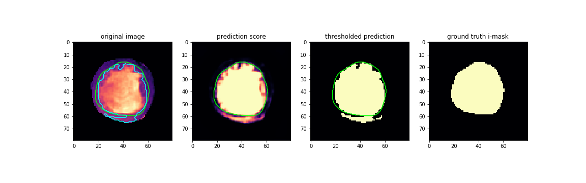

this repository shows loading of a radiology dataset with annotations (contours)

we assume that slices without annotations can be ignored 
(i.e. they are either not real true negatives, or we can ignore true negatives for this task)

## Dependencies
- pillow
- numpy
- pandas
- pytorch (in task 2)
- matplotlib (notebooks only)
- opencv
- numba

## Assignment 1
[see here](asgn1.md)

## Assignment 2

### Part 1: Parse the o-contours

#### Implementation notes
I had to modify `get_slice_set` and `match_case_filenames` function to take
directory name for o-contours, and `read_slice_with_annotations` function 
to call parsing for o-contours if respective column is present in the 
`HeartDataset.filenames` table. 
I also added `join` flag for table join type to the `match_case_filenames` function,
which is helpful for data exploration.
I re-used same reader class `ContourDir` as for i-contours within that function.

I chose to keep these functions separate from the `HeartDataset` for now as it made debugging easier.
For production, they might be incorporated into `HeartDataset` class.

As a result of changes, every item returned by `HeartDataset` objects (initialized with a table containing 
`"o-contours"` column) now contains `omask` field
(and `ocontour` if `with_contour=True` is specified at class initialization)

#### Important Observations
Not all i-contours are contained within o-contours (11 images out of 46 are affected).
Sometimes it is drawing error (1--3 pixel of i-contour are outside the o-contour in 2 images),
but often it is a gross error (200--500 pixels, all in 9 images from 'SC-HF-I-6' case).
X-Y axis flipping does not explain this error.

### Part 2: Heuristic LV Segmentation approaches

1. The differences in pixel intensities inside the blood pool (inside the i-contour) to those inside the heart muscle (between the i-contours and o-contours)
can be used to derive i-contours. To explore this possibility, I performed following visualizations and experiments:

- pixel intensities within the pool and the muscle for one image slice

- histograms for pixel intensities within the pool and the muscle for one image slice

- in order to automatically create the i-contours, given the o-contours, I applied Otsu method.
  To be able to use o-mask to narrow down the pixels considered, I had to re-implement thresholding steps.
  I also used dilation operation to post-process the thresholded image.
  The code can be found in [task4.py](task4.py) and [this notebook](asgn2-threshold.ipynb).

  Other thresholding methods can be considered, but given constraint of masking, only Otsu with some pre/post-processing has been explored so far.

  The results are quite OK (IoU = 0.81 +/- 0.02)

2. Other heuristic (non-machine learning)-based approaches, besides simple thresholding, that might work in this case:
potentially morphologic dilation of the space outside o-contour, which had to assume some constant width of the muscle.

3. Appropriate deep learning-based approach to solve this problem would involve any semantic segmentation model, 
such as U-net or Segnet like architectures, with aggressive data augmentation.
In order to reduce search space, close-up images with only within LV space should be considered.
In my quick implementation trained for 20 epochs, I achieved IoU of 0.87 +/- 0.01 (trained on 3 cases, tested on 1 case), 
which is an improvement over thresholding-based approach. Still some severe morphological artifacts can be found in predictions
(see figure below for the same slice as above).

code in [unet.py](unet.py) and [this notebook](asgn2-deeplearning.ipynb)

4. What are some advantages and disadvantages of the deep learning approach compared your chosen heuristic method?

Caviat: In terms of implementation, I did not use training/validation set split to tune heuristic hyperparameters, so
comparison might not be fair.

**Advantages of DL**: DL methods are more flexible and generally achieve higher performance given _enough data_. In this case,
IoU achieved with DL methods was still higher than one achieved with heuristic methods.

**Advantages of heuristics**: Generally, heuristic method are computationally faster and require less data.
Formally speaking, there is no training procedure for heuristic methods, so they require no training data. 
Practically though, hyperparameter optimization still have to take place and some data is required, which still normally takes fewer
cases. 

**Disadvantages of DL**: Due to their high complexity, DL models are black box, i.e. it is hard to explain to human why the machine did what it did. Explainability
can be achieved by using additional explanatory model, examining inputs and (intermediate) outputs, 
and rarely by looking within the model itself.

